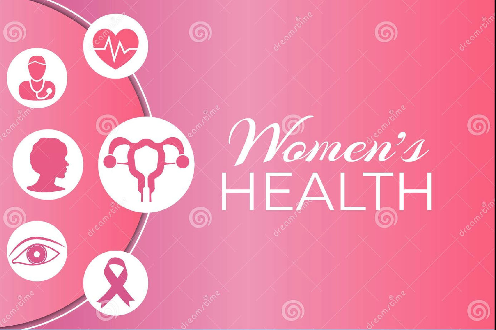

# Women’s Health Chatbot 🤖🌸

This repository contains code, data, and deployment instructions to create a **domain-specific chatbot** focused on women’s health topics, including periods, pregnancy, breast cancer, menopause, fertility, and more.





The chatbot is **fine-tuned on a custom dataset** using Hugging Face Transformers, and deployed via a **Gradio** web UI for easy interaction.

---

## 💡 Features

✅ Fine-tuned language model for **empathetic, informative answers**  
✅ Covers women’s health topics: periods, pregnancy, menopause, breast cancer, fertility, and mental health  
✅ Deployed with Gradio for a **user-friendly web interface**  
✅ Includes **disclaimer** to ensure safe AI usage  
✅ Scalable for updates, expansion, and multi-language support  

---

## 📁 Repository Structure

```plaintext
women-health-chatbot/
├── data/
│   └── final_women_health_chatbot_100.jsonl   # Dataset (Q&A format)
├── fine_tune.py                               # Script to fine-tune the model
├── app.py                                     # Gradio UI app
├── requirements.txt                           # Python dependencies
└── README.md                                  # Project documentation

